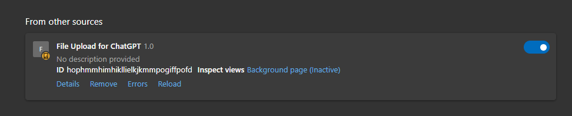

# ChatGPTFileuploadEdgeExtension

This extension will place a file upload for you on the ChatGPT website. Allow you to process your own scripts, files, documents, code, database and more in chat. Allow ChatGPT to work with your own data, answering questions, giving suggestions and updating the file. Props go to "Automate My Life" on Youtube, for the base code.

1. Clone this repository
2. Open the Edge browser and navigate to the following URL: `edge://extensions`.
3. Enable the "Developer mode" toggle switch at the bottom-left corner of the page.
4. Click the "Load unpacked" button and select the directory where you saved your extension files.
5. The extension should now be loaded and activated in the Edge browser.
6. Visit the webpage `https://chat.openai.com/` to test if the extension functions as expected.
